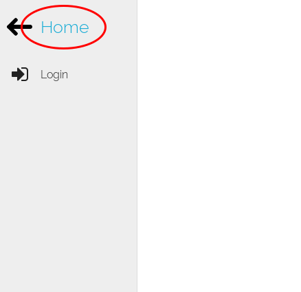
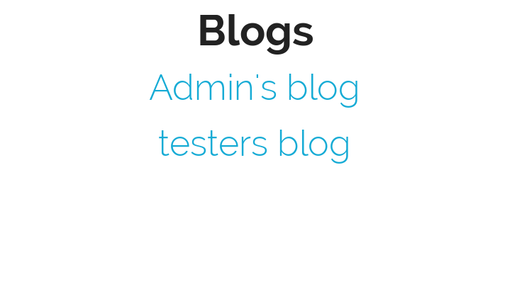
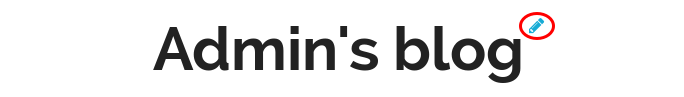

Blogs
=====

Blogübersicht
-------------

Um zur Übersicht der Blogs zu kommen, drücken Sie den Link zum "Home", dies ist eingeloggt sowie ohne eingeloggt zu sein möglich.

Blogs anschauen
---------------

Um sich einen Blog anzuschauen, drücken die auf den Namen des gewünschten Blogs.

Blog bearbeiten
---------------

Um seinen eigenen Blognamen zu ändern, drücken Sie auf das Bleistift-Icon neben dem Titel.

.. figure::  _static/images/blog_edit.png
    :align: center

Ändern Sie den Blognamen und drücken Sie auf Speichern.
