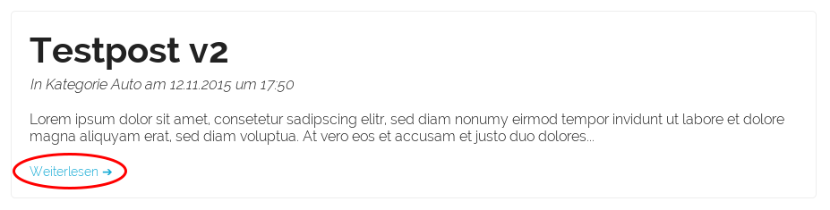
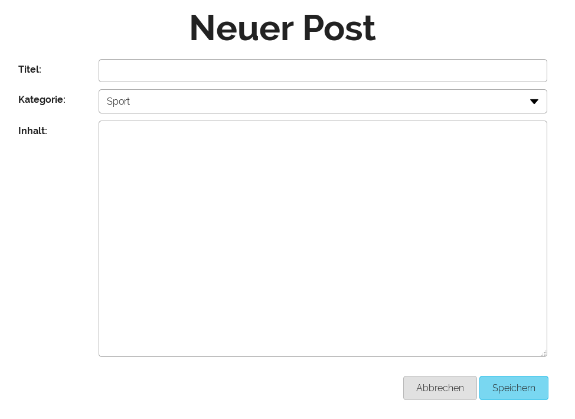

Posts
=====

Post anschauen
--------------

Um einen Post komplett zu lesen, drücken Sie in der Übersicht auf den "weiterlesen"-Link.

Post bearbeiten / löschen / erstellen
-------------------------------------

Um einen Post zu löschen oder zu bearbeiten, drücken Sie das entsprechende Icon. Das passende Formular / der passende Dialog wird danach erscheinen.

Um einen neuen Post zu erstellen, klicken Sie auf den Link im Menu.

Füllen Sie das Formular aus und drücken Sie auf "Speichern".

Kommentare
----------

Um einen Kommentar zu hinterlassen, müssen Sie eingeloggt sein. Füllen Sie den Text aus und drücken Sie auf "Speichern".
